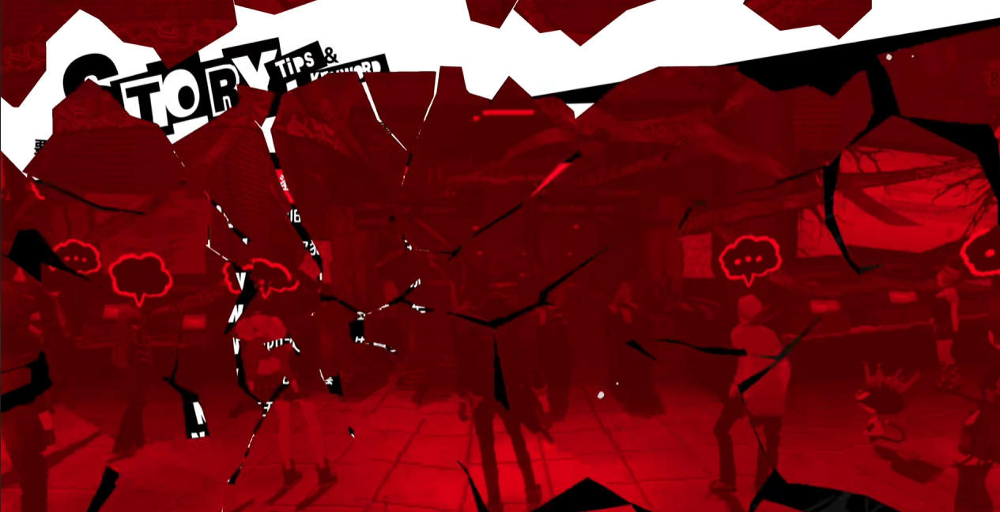
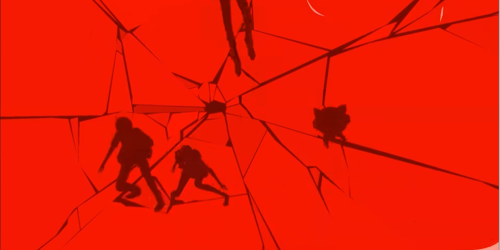

# jyan0855_9103_tut7

## 1.Imaging Technique Inspiration

My idea was inspired by the UI of a game called Persona 5. The game is famous for its smooth UI and unique art style. Here is a short video showing the menu UI for the game.[The Showcase for Persona 5 UI](https://www.youtube.com/watch?v=VqJnmphV9R8)
What I have found interesting is the glass-breaking effect in the UI which looks really smooth for changing between two pages. This could be a useful animation for switching different pages in the project.

## 2.Coding Technique Exploration

I have found two different ways to achieve similar effects on GitHub. 
The first way is to cover a broken glass picture on the page at the location where the mouse is clicked. The new picture will then be drawn after three clicks. This is simple to achieve but impossible to make glass falling animation.

The second way is better although it uses some techniques that we haven't learnt. It draws random length and weight straight lines from the mouse click location. At the end of that line, another line will be created and with a smaller weight. 

[First way](https://github.com/3daddict/glass-shatter-effect)

[Second way](https://github.com/leils/shatter-sim)
